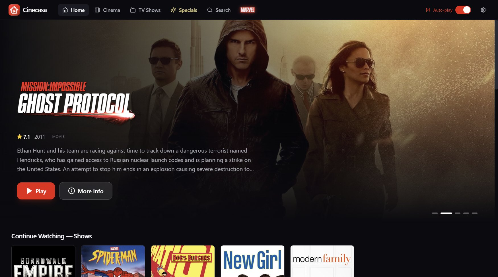
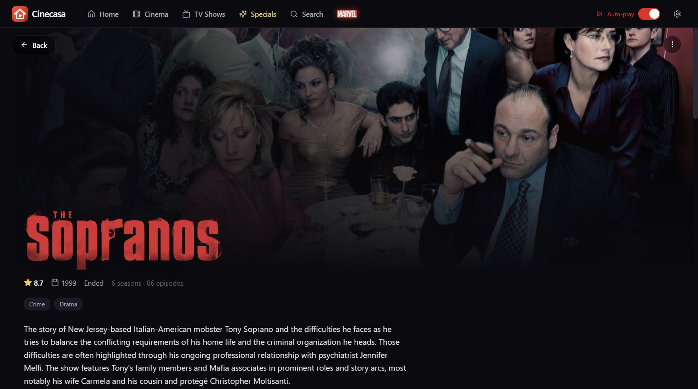
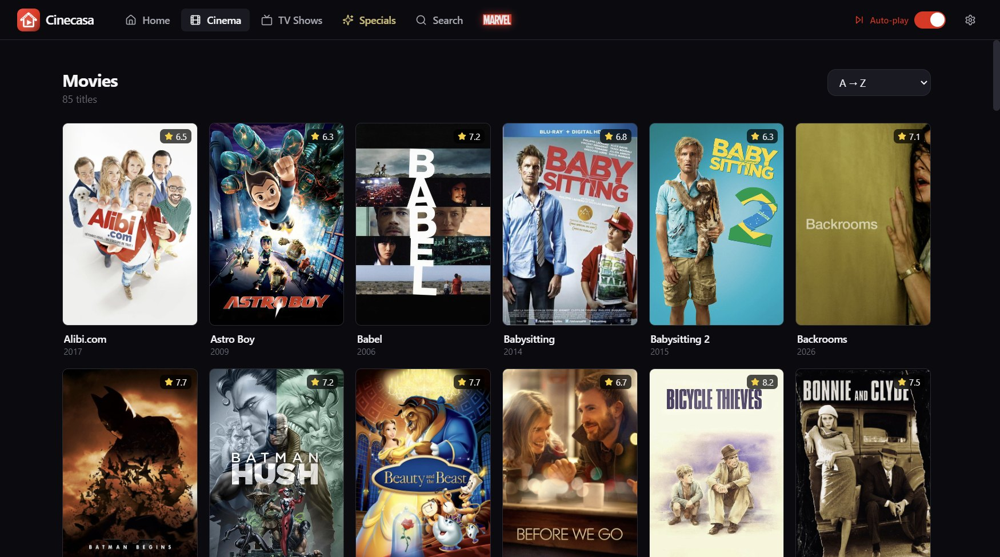
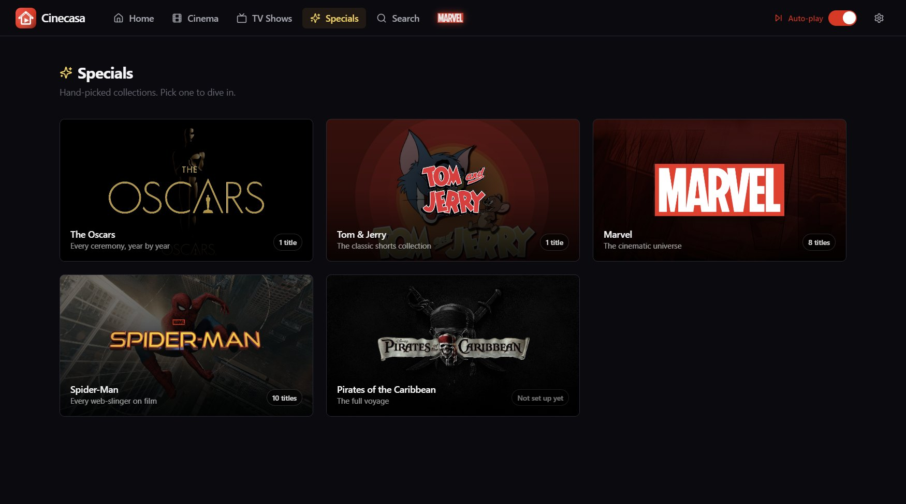
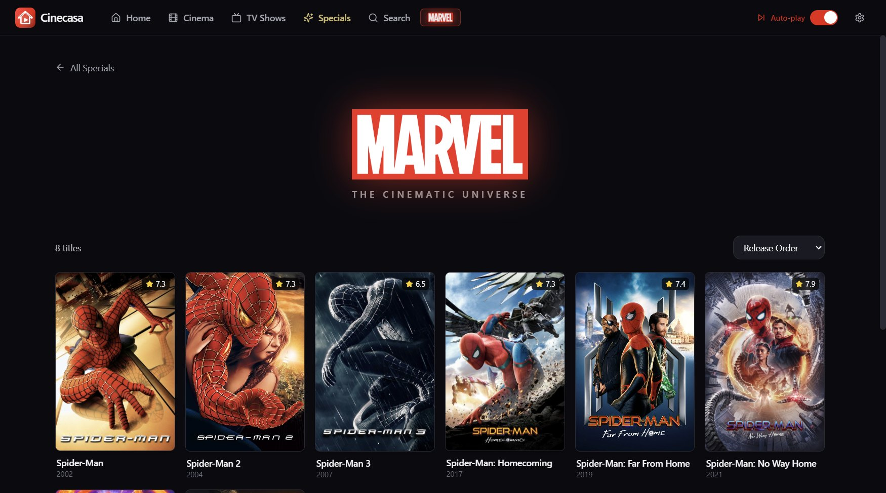

<p align="center">
  
</p>

<h1 align="center">Cinecasa</h1>

<p align="center">
  <em>Cine + casa: a home cinema for the movies and TV shows already on your drives.</em>
</p>

Cinecasa is a Windows desktop app that turns local video folders into a streaming-service-style library, with artwork, descriptions, ratings, cast and episode details. Playback happens in **MPC-HC**: Cinecasa launches the player, follows your progress while you watch, and brings you back to the exact second you stopped.



## Features

- **Automatic library**: scans the folders you choose, recognizes movies and episodes from their file and folder names, and matches them on TMDB
- **Rich metadata**: posters, backdrops, title logos, ratings, genres, cast, seasons and episode stills, cached locally so the library opens instantly
- **Resume anywhere**: tracks the playback position in MPC-HC and resumes from the exact point; items become *watched* at 95%
- **Continue Watching** rows for movies and shows, including the next episode to watch
- **Auto-play next episode**, with a toggle in the header
- **Specials**: themed hubs with their own artwork and ordering (Marvel, Spider-Man, Pirates of the Caribbean, the Oscars ceremonies, and Tom & Jerry with a random-episode mode)
- **Manual control**: fix a wrong match, edit episode metadata and lock it so rescans don't overwrite it
- **Search** across the whole library

| Show page | Movies |
|---|---|
|  |  |

| Specials | Marvel hub |
|---|---|
|  |  |

## How it works

```
 ┌──────────────── Renderer (React) ────────────────┐
 │  Home · Movies · TV Shows · Specials · Search     │
 └───────────────────────┬──────────────────────────┘
                         │  typed IPC bridge (window.api)
 ┌───────────────────────▼──────────── Main process (Electron) ─────────────┐
 │  Scanner + filename parser ──► TMDB client ──► image cache                │
 │                 │                                                          │
 │                 ▼                                                          │
 │            SQLite library (movies, shows, seasons, episodes, progress)     │
 │                 ▲                                                          │
 │  Playback: spawn MPC-HC at the saved position ──► poll its web interface   │
 └───────────────────────────────────────────────────────────────────────────┘
```

- **Scanning**: file and folder names are cleaned of release tags (resolution, codec, source) and parsed into a movie title and year, or a show, season and episode (including multi-part episodes).
- **Metadata**: matched on TMDB, stored in SQLite with `better-sqlite3`, and images are downloaded once and served to the UI through a custom `cinecasa-img://` protocol.
- **Playback tracking**: before launching MPC-HC, Cinecasa picks a free port and temporarily points MPC-HC's web interface at it (in its `.ini` file or the registry), then starts the file at the saved position. While you watch, it polls MPC-HC's status page for the position and duration and saves progress. When the player closes, the final position decides whether the item is *in progress* or *watched*, and the next episode can start automatically.

## Tech stack

| | |
|---|---|
| App shell | Electron |
| UI | React 18, TypeScript, Tailwind CSS, Framer Motion, React Router |
| Database | SQLite (`better-sqlite3`) |
| Metadata | TMDB API |
| Player | MPC-HC (web interface) |
| Build | Vite, `vite-plugin-electron`, electron-builder |

## Getting started

### Requirements

- Windows 10 or 11
- Node.js 20+
- [MPC-HC](https://github.com/clsr2/mpc-hc/releases) installed
- A free [TMDB API key](https://www.themoviedb.org/settings/api)

### Install and run

```bash
npm install
npm run dev
```

`npm install` rebuilds `better-sqlite3` for Electron automatically. `npm run dev` starts Vite and opens the app with hot reload.

In **Settings**, add your library folders (as Movies or TV Shows), paste your TMDB API key and check the path to `mpc-hc64.exe`, then run a scan.

### Build a Windows installer

```bash
npm run dist
```

The installer is written to `release/`.

## Project structure

```
├── electron/              # Main process
│   ├── main.ts            # Window, image protocol, startup
│   ├── preload.ts         # Typed window.api bridge
│   ├── db/                # SQLite schema, connection and queries
│   ├── ipc/               # Library, metadata, playback and settings handlers
│   └── services/          # Scanner, filename parser, TMDB client, image cache, MPC-HC control
├── shared/                # Types and IPC channel names shared by both processes
├── src/                   # Renderer (React)
│   ├── routes/            # Home, Movies, TV Shows, Specials, Search, details, Settings
│   ├── components/        # Hero banner, rows, cards, metadata editors, navigation
│   └── lib/               # Formatting, Specials and franchise definitions
└── assets/                # App icon and Specials artwork
```

## Acknowledgments

This product uses the TMDB API but is not endorsed or certified by TMDB.

Cinecasa is a personal, non-commercial project. Movie titles, posters and the logos and artwork used in Specials (Marvel, Spider-Man, Pirates of the Caribbean, the Oscars, Tom & Jerry) belong to their respective owners.

## License

Code: [MIT](LICENSE).
